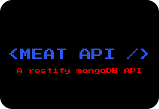

<h1 align="center">
    
    <br>
    MEAT - API
</h1>

## 💻 How to run

---

First of all certify that you have Node.js 9.3.0 version installed.

I recomend to use nvm to manage between node versions.

You may have the mongo DB version 3.6.2 to be compactible with the current mongoose.

I recommend to use a docker container to be more easy envoiremnt setup.

You can run the following command:

```
docker run --name mongodbOld -p 27017:27017 -e MONGO_INITDB_ROOT_USERNAME=codedemobr -e MONGO_INITDB_ROOT_PASSWORD=123abc mongo:3.6.2

```

Be smart. You can change the passaword, container name and others configs. So you need to change the user permitions in the collection:

```
db.createUser(
{
   user: "codedemonbr",
   pwd: "123abc",
   roles: [
     { role: "readWrite", db: "DATABASE NAME" }
   ]
})

```

1. Run `npm install`;
2. Run in two instances of terminal `npm run compile` and `npm run runDev`;
3. Test API routes using [Insomnia][insomnia] or [Postman][postman] or [Chromium][chromium] Browser

## 🛣 Routes

---

**In insomnia you will have files to import and test the api.**
Select one to have access to the routes.
You can run `npm run test` to run the tests.

## 🗄️ How to access MongoDB database

---

You will need to have MongoDB installed. Start mongod:

```
 mongod --dbpath=../path/to/mongoData/db
```

Certainly you need to know where is your mongo data path to replace.

[Repository](#) with a test database.

## 🚀 Technologies

---

This project was developed live [Thiago Santos][linkedin] with the following technologies:

- [Node.js](https://nodejs.org/en/)
- [Resttify](http://restify.com/)
- [Typescript][ts]
- [MongoDB](https://www.mongodb.com/)
- [VS Code][vscode] with [EditorConfig][vceditconfig] and [ESLint][vceslint]

## 📝 License

---

This project is under the MIT license. See the [LICENSE][mit license] for more information.

---

Made with inner 🔥 by ThiagoSantos :wave: [Get in touch!][linkedin]

[ts]: https://www.typescriptlang.org
[vscode]: https://code.visualstudio.com/
[yarn]: https://yarnpkg.com/
[vceditconfig]: https://marketplace.visualstudio.com/items?itemName=EditorConfig.EditorConfig
[vceslint]: https://marketplace.visualstudio.com/items?itemName=dbaeumer.vscode-eslint
[linkedin]: https://www.linkedin.com/in/thiago-henrique-santos-256b948a/
[mit license]: https://mit-license.org/
[insomnia]: https://insomnia.rest/
[postman]: https://www.postman.com/
[chromium]: https://download-chromium.appspot.com/
